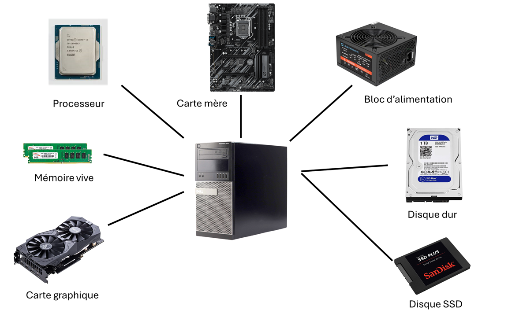
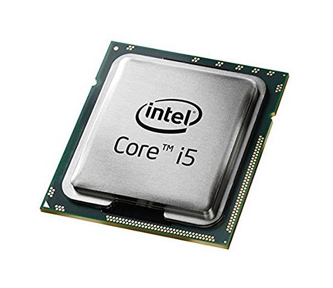

# L'ordinateur #
## Vue physique ##
L'ordinateur est, à la base, un ensemble de composantes physiques interagissant ensemble. Chacune de ces composantes joue un rôle spécifique dans le fonctionnement du système.

Notez bien que ceci reste une vue à haut niveau - plusieurs détails sont omis, d'autres composantes existent, et toutes ces composantes ne sont pas nécessaires au fonctionnement du système.

### Le processeur ###

Le processeur est le cerveau de l'ordinateur. Le fonctionnement du processeur est purement électronique - des données encodées sous format électrique sont transformées par le biais d'assemblage de circuits logiques afin de produire de nouvelles données. 

Les opérations réalisées par le processeur sont extrêmement simples et limités mais le processeur en exécute des milliards par seconde ce qui lui permet de réaliser des opérations complexes. 

### Support d'entreposage - Disques durs et SSD ###
Le rôle du support d'entreposage est de conserver les données sur une période de temps étendu. **Les différents supports d'entreposages vont conserver les données qui y sont entreposés même sans alimentation électrique.** 

Différents types de support d'entreposage existent, chacun avec leurs avantages et inconvénients. Les disques durs entreposent les données sur des plateaux magnétique en rotation tandis que les SSD entreposent les données dans des cellules électroniques.

### Mémoire vive ###
L'accès à l'information est plus rapide lorsqu'elle est en mémoire vive que lorsqu'elle sur un disque dur ou bien un SSD. Cependant, la mémoire vive n'est pas persistante - une fois l'alimentation électrique retirée (e.g. l'ordinateur est éteint), l'information est perdue.

La mémoire vive est donc utilisée par le système comme mémoire de travail. Les données et les programmes y sont chargés afin que le processeur y ai un accès rapide.

L'analogie suivante pourrait être utilisée afin d'illustrer les différences entre un disque dur et la mémoire vive : 
 - La mémoire vive serait comparable au bureau sur lequel vous allez travailler.
 - Le disque dur serait comparable à une filière.
 - La filière peut contenir plus de documents que le bureau. Cependant, la filière n'est pas très pratique pour y effectuer du travail.
 - Pour réaliser un travail, on va chercher les documents dans la filière et les déposer sur le bureau.
### Carte mère ###
La carte mère rempli essentiellement deux fonctions : 
- Connecte les différentes composantes entres elles.
- Fourni les mécanismes permettant au processeur de communiquer avec les composantes physiques.

## Vue logique ##
### Système d'exploitation ###
Logiciel qui est exécuté au démarrage de l'ordinateur. Le système d'exploitation est responsable de : 
- Gérer les ressources matérielles (disque, mémoire, cartes d'extension, clavier, souris, écran, ...)
- Gérer les processus
- Gérer l'accès au réseau

Quelques exemples de système d'exploitation  :
- Windows
- OS X
- Linux
### Programme, logiciel et application ###
Un programme est un ensemble d'instructions permettant de réaliser une fonction. En logiciel est un ensemble de programme souvent accompagné de données permettant de réaliser une fonction. Une application est un logiciel destiné à être directement utilisé par un utilisateur.

Les trois expressions sont souvent utilisées de manière interchangeable.

Quelques exemples d'applications : 
- Notepad
- Google Chrome
- Microsoft Word
- Paint
### Processus###
Instance d'un programme en cours d'exécution.
### Fichier ###
Ensemble de données séquencées et regroupé sous un même nom. Sous Windows, le nom d'un fichier va contenir une "extension" identifiant le format du fichier. 

L'extension - si présente - est à la toute fin du nom de fichier et elle est toujours précédée d'un point.  En langage courant, on a tendance à inclure le point dans l'extension.

**Exemple** : Dans le fichier "toto.txt", l'extension est "txt". On peut aussi dire ".txt"
#### Exécutables ####
Les programmes sont stockés dans des fichiers. Dans ces situation, le fichier va contenir des métadonnées permettant au système d'exploitation de lire et exécuté le programme ainsi que les instructions à exécuter par le processeur. Ces fichiers sont généralement appelées des "fichiers exécutables" ou simplement des "exécutables".

Ces fichiers peuvent être exécutés directement par le système d'exploitation qui va en instancier un processus.

Les fichiers exécutables vont avoir l'extension ".exe" sous Windows. Exemple : notepad.exe
#### DLL ####
Les fichiers DLLs contiennent des séquences d'instructions à exécuter par le processeur. Les DLLs sont chargés à l'exécution d'un processus afin de compléter les instructions de celui-ci.

Un DLL ne peut pas être exécuté par lui-même.

L'extension d'un fichier DLL est... ".dll"
#### Données ####
Un fichier de données va contenir de l'information destinée à être consommée par des programmes. Les fichiers de données ne peuvent pas être exécutés par eux-mêmes. 

Il existe une panoplie de formats différents - certains standardisés, d'autres plus ad-hoc - et chacune dispose de sa propre extension.

Par exemple  : 
- Un fichier ".docx" est un fichier contenant des informations décrivant le contenu et le formatage d'un document texte. Les fichiers ".docx" sont lues par l'application Word.
- Un fichier ".zip" est une archive compressée. Une archive contient d'autres fichiers et dossiers. Un logiciel de décompression doit être utilisé pour en extraire le contenu.
