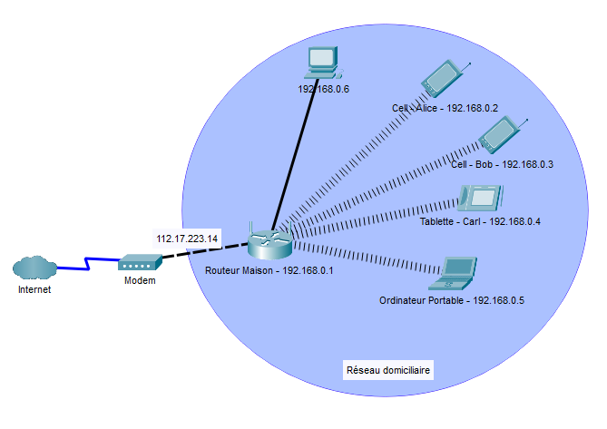

# Introduction aux réseaux #
Un **réseau** est un ensemble d’ordinateurs et d’appareils reliés entre eux afin d’échanger des informations et de partager des ressources.

Les appareils doivent être interconnectés  - directement ou bien indirectement - afin de pouvoir communiquer entre eux.

La connexion à un réseau se fait par le biais d'un point d'accès. Le point d'accès peut être sans-fil (WiFi) ou bien filaire (connexion Ethernet).

### Adresse IP ###
Une adresse IP est une adresse qui sert à identifier un système dans réseau. La communication entre deux systèmes se fait toujours par le biais d'adresses IP. Il existe 2 standards d'adresses IP : IPv4 et IPv6.

##### IPv4 #####
Une adresse IPv4 est composée de 4 nombres entre 0 et 255 séparées d'un point.
Exemples : 
- 10.144.2.33
- 122.255.0.8
- 33.7.21.8

L'adresse 127.0.0.1 est spéciale - elle réfère toujours soit même. 

### LAN et Internet ###
#### Internet ####
Réseau global distribué à l'échelle mondiale.
#### LAN ####
Un LAN (**L**ocal **A**rea **N**etwork) est réseau restreint à un certain emplacement géographique restreint. Par exemple, on peut parler d'un réseau domiciliaire, du réseau d'une petite entreprise ou même du réseau du cégep.

L'objectif d'un LAN est d'interconnecté une certaine quantité d'équipement mais, surtout, de leur fournir un lien vers internet.

Les adresses entre 192.168.0.1 et 192.168.255.255 ainsi que celles entre 10.0.0.1 et 10.255.255.255 sont réservés à être utilisés au sein des réseaux locaux. Ces adresses ne sont pas uniques - elles sont réutilisés par les différents LAN. La conséquence est qu'on ne peut pas directement s'adresser à un système dans un LAN de l'extérieur de celui-ci.
#### Routeur ####
Un routeur est un équipement qui permet la communication entre différents réseaux. Par exemple, entre votre LAN et l'internet. Une communication typique via internet va impliquer plusieurs routeurs.

Un routeur va avoir une adresse IP pour chaque réseaux dans lesquels il se trouve. Dans le cas d'un routeur domiciliaire, il va disposer d'une adresse au sein de votre LAN et d'une adresse publique sur internet.

L'adresse publique de votre routeur n'est pas permanente - elle est sujette à changer sporadiquement.
#### NAT ####
Le **NAT** (Network Address Translation) est un mécanisme qui permet à plusieurs appareils d’un réseau local (exemple: le réseau de la maison) d’utiliser une seule adresse IP publique pour accéder à Internet.

Le routeur « traduit » les adresses privées des appareils internes (ordinateur, téléphone, etc) en une adresse publique unique lorsqu’ils communiquent avec l’extérieur. 

Le NAT est complètement transparent pour les équipements impliqués dans la communication. Il peut y avoir plusieurs niveaux de NAT dans une même communication.
