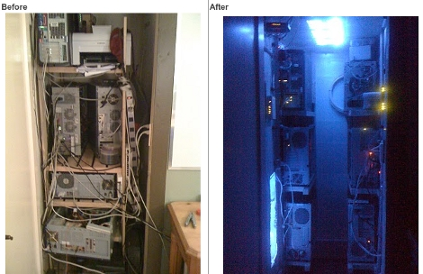

# Services Internet #

#### Modèle Client-Serveur ####
C’est une façon de modéliser la communication entre deux ordinateurs.
- Le **serveur** est un ordinateur qui offre un service (par exemple : héberger un site web, stocker des fichiers, gérer des courriels).
- Le **client** est l’ordinateur ou l’application qui demande ce service (par exemple : un navigateur web qui demande l’affichage d’une page).
Le client envoie une **requête**, et le serveur répond avec les **données** ou le service demandé.

N'importe quel ordinateur peut faire office de serveur - il n'est pas nécessaire d'avoir du matériel particulier.

#### Le Web ####
C’est un ensemble de pages et de sites accessibles sur Internet. On navigue le web à l'aide de ce que l'on appel un "navigateur". Quelques exemples de navigateurs : 
- Firefox
- Chrome
- Edge
- Opera
- Safari

Le navigateur est un **client** web qui effectue des requêtes envers un **serveur** web.
###### HTTP ######
C’est le protocole (langage) utilisé entre le navigateur (le client) et le site (le serveur) pour demander et recevoir les pages web. Lorsque l'on navigue sur une page web, le navigateur envoies une requête `http`, et le serveur renvoie la page correspondante.

`http` est un protocole texte non chiffré. C'est à dire que l'entièreté de l'information qui est échangée entre le client et le serveur : 
 - est sous format texte
 - est entièrement lisible par tous les parties concernées dans la communication. Cela inclus tous les routeurs impliqués dans la communication.
###### HTTPS ######
`https` est la variante sécurisée de `http`. La communication entre le client et le serveur est chiffrée, la protégeant de la vue des intermédiaires.

#### Domaines et URL ####
Bien que la communication réseau se fait par le biais d'adresses IPs, celle ci peuvent être difficile à retenir et a partager. Certains systèmes ont été développés afin de simplifier cet aspect.

##### Domaines #####
Un nom de domaine est un identifiant texte facile à retenir pour accéder à un système via le réseau. 

Comme un annuaire téléphonique, un système appelé **DNS** (Domain Name System) traduit ce nom en une adresse IP afin que l’ordinateur sache exactement où trouver le système qu'il essaie de rejoindre.

Un nom de domaine est composé de plusieurs fragments de texte séparés d'un point. 
Exemple : 
- `www.google.com`
- `www.claurendeau.qc.ca`
- `facebook.com`

Chacun des fragments de texte représente un niveau dans une hiérarchie. Le premier niveau - celui au sommet - est le fragment le plus à droite. Le fragment immédiatement à sa gauche en est un **sous-domaine**, et ainsi de suite.

Pour `www.google.com`:
- *"google"* est un sous-domaine de *"com"*
- *"www"* est un sous-domaine de *"google.com"*

Pour `www.claurendeau.qc.ca` :
- **"qc"** est un sous-domaine de ***"ca"**
- **"claurendeau"** est un sous-domaine **"qc.ca"**
- **"www"** est un sous-domaine de **"claurendeau.qc.ca"**

Chaque niveau est responsable et en contrôle de ses sous-domaines. 
##### URL #####
L'URL est ce que l'on retrouve dans la barre d'adresse de votre fureteur. C’est l’« *adresse complète* » d’une ressource sur Internet (page web, image, vidéo, etc.).  
Elle indique :
- le **protocole** utilisé (ex. `http` ou `https`),
- le **nom de domaine** (ex. `www.exemple.com`),
- et parfois le **chemin** précis vers le contenu (ex. `/images/photo.jpg`).

L’URL dit _où aller_ et _comment y accéder_.

